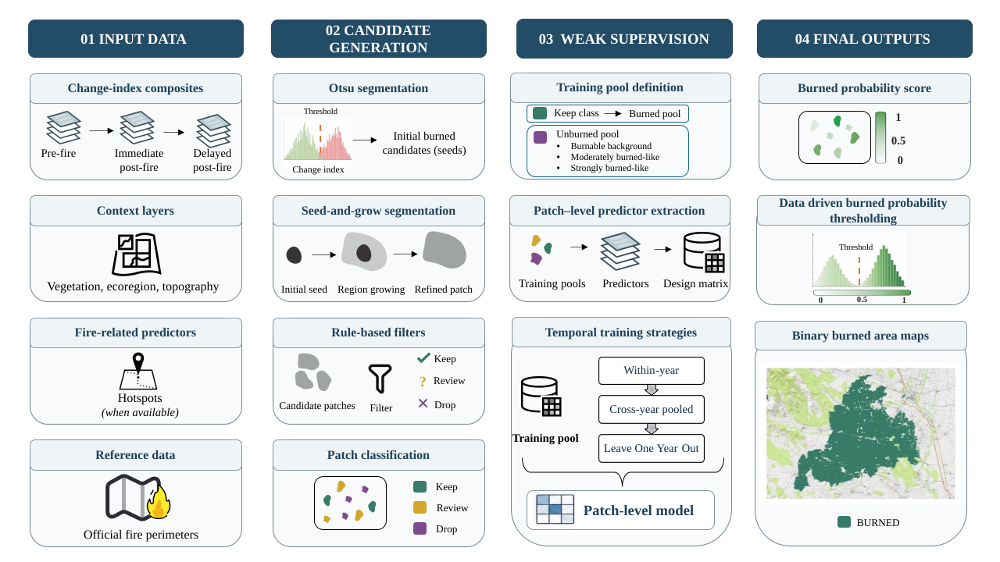

```{=html}
<style>
.justified p {
  text-align: justify;
}
</style>
```

## OtsuFire: A self-labelling framework for wall-to-wall burned-area mapping across sensors and decades

::: {.justified}

OtsuFire is an open-source R package for long-term, wall-to-wall burned-area reconstruction. It implements a self-labelling, weakly supervised framework that generates training labels without requiring prior knowledge of fire locations or reliable target-year reference data.

The framework separates supervision generation from final classification through four stages:

**(i) Change-index mosaic preparation:** Assemble change-index tiles (e.g., RBR, dNBR or RdNBR derived from pre- and post-fire composites) into an annual raster.

**(ii) Candidate generation and rule-based filtering:** Delineate candidate patches using Otsu thresholds and seed-and-grow segmentation, then apply spectral, spatial and contextual filters,  producing  `keep`, `review` or `drop` candidate classes. These classes provide the basis for the internally supervision construction.

**(iii) Weak supervision:** Construct burned and unburned training pools, train an XGBoost classifier, and estimate `p_burned` for candidate patches to produce the final burned-area map.

**(iv) Independent validation:** Compare mapped burned areas with an external reference.

:::


::: {.column-page}

{width=100% fig-align="center"}

:::

## Useful links

- **Package and source code:** [OtsuFire on GitHub](https://github.com/olgaviedma/OtsuFire).
- **Step-by-step guidance:** [OtsuFire workflow book](https://github.com/nataliaquintero/OtsuFire-book).
- **Bug reports:** [GitHub issues](https://github.com/olgaviedma/OtsuFire/issues).

## 1) Load the package

```{r}
library(OtsuFire)
```

Load the packages used to read, inspect and process spatial data.

```{r}
suppressPackageStartupMessages({
  library(sf)     # Vector data: fire perimeters and boundaries.
  library(terra)  # Raster data: change indices and spatial masks.
})

# Disable s2 for operations on longitude/latitude data.
# This does not reproject the data; EPSG:3035 operations are already planar.
sf::sf_use_s2(FALSE)
```