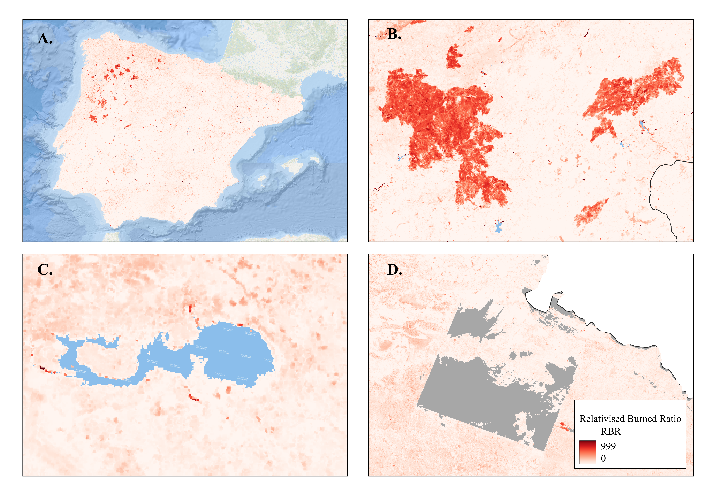

```{=html}
<style>
.justified p {
  text-align: justify;
}
</style>
```

## Change-index mosaic

::: {.justified}

Let's start by preparing the imagery for one fire year.

In this example, we use change-index tiles exported from Google Earth
Engine. The change index is calculated from pre- and post-fire
composites and describes the spectral change between them.

The study area is split across several tiles. We will combine these
tiles into a single raster, called a **mosaic**, for 2013. This mosaic
will be the input for the next stage: identifying potentially burned
patches.

:::

## 1. Load OtsuFire

First, load the package in your R session.

```{r}
library(OtsuFire)
```

## 2. Locate your input data

We need two inputs:

- A folder containing the change-index tiles for 2013.
- A spatial file defining the study area.

Replace the paths below with the locations on your computer.

```{r}
tiles_folder <- "data/change_index_tiles/2013"

mask_path <- "data/study_area/study_area.shp"

tile_pattern <- "RBR_2013_tile*.tif"
```

```{r}
#| include: false
if (file.exists("_local_paths.R")) source("_local_paths.R")
```

The study-area mask defines the area we want to include in the mosaic.
It is separate from the reference-coverage mask used later for validation.

Let's check that R can find the folder and the mask file.

```{r}
dir.exists(tiles_folder)

file.exists(mask_path)
```

Both checks should return `TRUE`. If either returns `FALSE`, check
the corresponding path before continuing.

## 3. Build the mosaic

We can now combine the tiles into one raster.

The example below specifies:

- `folder_path`: the folder containing the tiles.
- `year`: the fire year being processed.
- `raster_pattern`: the filename pattern used to select the tiles.
- `mask`: the study-area boundary.
- `lower_cap`: the lower limit used to cap change-index values.

The value `-1000` is used for this example. Check that it is appropriate
for the index and numerical scale of your own rasters.

```{r}
#| eval: false

change_index_mosaic(
  folder_path    = tiles_folder,
  output_dir     = tiles_folder,
  year           = 2013,
  raster_pattern = tile_pattern,
  mask           = mask_path,
  lower_cap      = -1000
)
```
Mosaicking may take some time, depending on the number and size of
the tiles.

## 4. Check the result

After the function finishes, locate the output raster and inspect it
in your GIS software.

Check that:

- The mosaic covers the intended study area.
- There are no unexpected gaps or seams between tiles.
- The coordinate reference system and pixel size are correct.
- The values are consistent with the input change index.

Keep the output path: we will use it as the `change_index` input
in the next stage.


::: {.column-page}

{width=80% fig-align="center"}
:::
